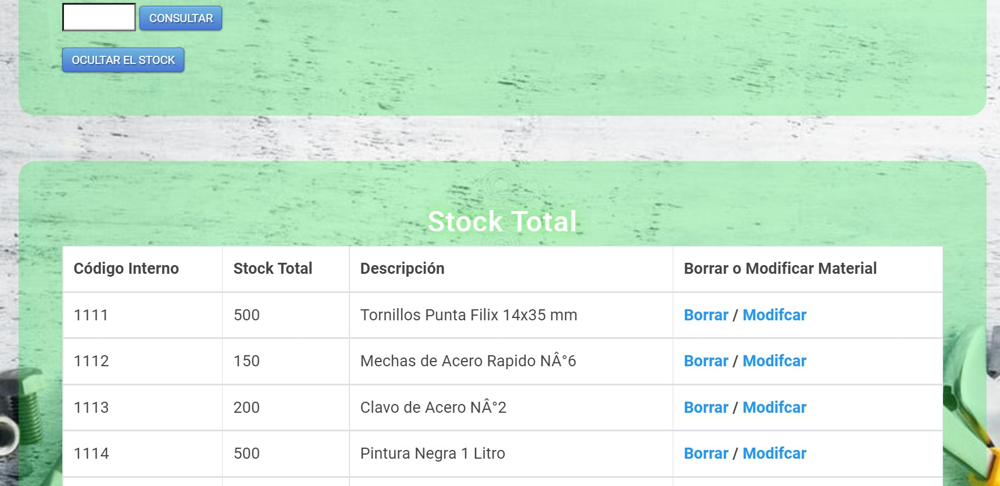

# Consulta de Stock de Materiales con Base de Datos
## Proyecto Final Programador Python

En este proyecto estaremos trabajando con 1 planillas csv llamada stock.csv la cual contendra todo el stock del negocios. Esta planilla se cargara en una Base de Datos cuando se inicie el programa por primera vez. Se podran realizar las consultass de los materiales que tenemos en stock, modificar las cantidades de estos materiales o la descripcion, agregar nuevos amteriales o incluso borrar materiales del stock. 
Abajo hay una breve descripcion de la planilla que se utilizara y la base de datos que se crea en el programa:

### Planilla **stock.csv**: 
En esta planilla tenemos la informacion de los materiales que contamos en stock y el dato de las cantidades que hay en stock de cada material con una breve descripcion del material. Esta planilla contiene una columna que se llama **Código Interno** propio del amterial, tro columna que se llama **Cantidad de Stock** la cual indica que cantidad tenemos de ese material y una ultima columna que se llama **Descripción** en donde hay una breve descripción del material. Esta planilla stock.csv es la que se carga en la Base de Datos del programa.

### Base de Datos **stock**: 
Esta es la Base de Datos que se genera la primera vez que se ejecuta el programa y se envia un endpoint por el servidor. En esta Base de Datos **stock** se carga la informacion que se encuentra en la plnailla **stock.csv** y todas las cciones del programa se realizan sobre esta Base de Datos. 

## Breve descripcion del funcionamiento

Cuando se ejecuta la conexion con el servidor se accede a la pagina de Inicio con la direccion host="127.0.0.1", port=5000 (127.0.0.1:5000). En esta pagina de Inicio se encuentra un mensaje de Bienvenida y nombre del Negocio junto con la inforacion del creador del programa y las sigueintes acciones a realizar:**Consultas**, **Agregar Material al Stock** y **Borrar Material del Stock** como Submenues en la parte superior de la pagina.

### Submenu **Consultas**: 
En esta accion podremos encontrar 3 consultas a realizar mediante 3 botones, primero boton **STOCK / BUSQUEDA / MODIFCAR / BORRAR**, segundo boton **CONSULTAR MATERIALES** y tercer boton **AGREGAR MATERIAL AL STOCK** 

## Boton **STOCK / BUSQUEDA / MODIFCAR / BORRAR**
En esta pagina aparecera una breve descripcion de lo que se podra realizar en la misma, podremos ver o ocultar el stock total del negocio, realizar busquedas de los materiales, modificar estos materiales buscados y ademas se podran borrarlos. Si el material esta dentro del stock aparecera una planilla con los datos del mismo y ademas tendra 2 botones donde se indicara que se podra realizar la modificacion del este material o directamente borrarlo.

Ejemplo: con el boton de Ver y ocultar el stock se puede desplegar la planilla del stock total o se puede ocultarla

Ejemplo: se puede realizar la busqueda de un material con el **Código Interno**, si el amterial esta en el stock aparecera una planilla con la informacion y ademas se podra **Modificar** o **Borrar** el material.

Ejemplo: si se realiza una busqueda y el material no esta cargado en la planilla, el mismo se podra agregar al stock

## Boton **CONSULTAR MATERIALES**
En esta pagina aparecera una breve descripcion de lo que se podra realizar en la misma, podremos realizar la consulta de los materiales cargados en stock mediante el Codigo Interno del mismo. Si el material esta en stock aparecera una tabla con su informacion, y un boton que nos permitira realizar modificaciones sobre el mismo. Si el material no esta en el stock, podremos agregarlo al mismo.

Ejemplo: el material esta en stock

Ejemplo: el material no esta en stock

## Boton **AGREGAR MATERIAL AL STOCK**
En esta pagina aparecera una breve descripcion de lo que se podra realizar en la misma, y podremos cargar nuevos materiales al stock. Tendremos que colocar el **Código Interno** del material, la **Cantidad de Stock** y una breve **Descripcion** del mismo. Si el Codigo Interno ya existe en el sistema nos saldra un mensaje indicandonos.

Ejemplo: se agrega un nuevo material al stock

Ejemplo: se agrega un nuevo material al stock pero el Codigo Interno ya existe

### Submenu **AGREGAR MATERIAL AL STOCK**: 
En esta pagina aparecera una breve descripcion de lo que se podra realizar en la misma, y podremos cargar nuevos materiales al stock. Tendremos que colocar el **Código Interno** del material, la **Cantidad de Stock** y una breve **Descripcion** del mismo. Si el Codigo Interno ya existe en el sistema nos saldra un mensaje indicandonos. Esto tambien esta erxplicado con ejemplos en el punto anterior. 

### Submenu **Borrar Material del Stock**:
En esta pagina podremos realizar la eliminacion de los materiales directamente, colocando el Código Interno del material se podra eliminarlo directamente. Si el material no esta cargado en sistema se indicara con un mensaje.

Ejemplo: el material esta cargado en el sistema

Ejemplo: el material no esta cargado en el sistema

